# Entity Relationship Diagram (Chen Notation Stylized)

Diagram ini menggunakan gaya visual **Notasi Chen** (Entitas = Kotak, Atribut = Oval, Relasi = Belah Ketupat) seperti yang diminta.

> **Catatan**: Karena banyaknya atribut pada setiap tabel, diagram dibagi menjadi beberapa cluster untuk menjaga keterbacaan.

```mermaid
flowchart TD
    %% Styling
    classDef entity fill:#f9f,stroke:#333,stroke-width:2px;
    classDef attr fill:#fff,stroke:#333,stroke-width:1px,stroke-dasharray: 5 5;
    classDef rel fill:#ccf,stroke:#333,stroke-width:2px,shape:rhombus;

    %% ---------------------------------------------------------
    %% MAIN ENTITIES
    %% ---------------------------------------------------------

    subgraph MASTER_DATA [Master Data]
        direction TB

        %% BARANG
        BARANG[BARANG]:::entity
        BARANG --- B_ID([id]):::attr
        BARANG --- B_KODE([kode_barang]):::attr
        BARANG --- B_NAMA([nama_barang]):::attr
        BARANG --- B_STOK([stok_total]):::attr
        BARANG --- B_HARGA([harga_satuan]):::attr
        BARANG --- B_LOKASI([lokasi]):::attr
        BARANG --- B_KONDISI([kondisi]):::attr

        %% KATEGORI
        KATEGORI[KATEGORI]:::entity
        KATEGORI --- K_ID([id]):::attr
        KATEGORI --- K_NAMA([nama]):::attr

        %% SATUAN
        SATUAN[SATUAN]:::entity
        SATUAN --- S_ID([id]):::attr
        SATUAN --- S_NAMA([nama]):::attr

        %% USERS
        USERS[USERS]:::entity
        USERS --- U_ID([id]):::attr
        USERS --- U_NAMA([name]):::attr
        USERS --- U_EMAIL([email]):::attr
        USERS --- U_ROLE([role]):::attr

        %% SUPPLIERS
        SUPPLIER[SUPPLIER]:::entity
        SUPPLIER --- SUP_ID([id]):::attr
        SUPPLIER --- SUP_NAMA([nama]):::attr
        SUPPLIER --- SUP_KONTAK([kontak]):::attr

        %% RELATIONS MASTER
        KATEGORI --- HAS_KAT{Memiliki}:::rel
        HAS_KAT --- BARANG

        SATUAN --- HAS_SAT{Memiliki}:::rel
        HAS_SAT --- BARANG
    end

    %% ---------------------------------------------------------
    %% TRANSACTIONS
    %% ---------------------------------------------------------

    subgraph TRANSAKSI [Pencatatan Barang]
        direction TB

        PENCATATAN[PENCATATAN]:::entity
        PENCATATAN --- P_ID([id]):::attr
        PENCATATAN --- P_KODE([kode]):::attr
        PENCATATAN --- P_TGL([tanggal]):::attr
        PENCATATAN --- P_JENIS([jenis]):::attr

        P_DETAIL[DETAIL_PENCATATAN]:::entity
        P_DETAIL --- PD_QTY([jml]):::attr
        P_DETAIL --- PD_KONDISI([kondisi]):::attr

        %% Relations
        USERS --- DO_CATAT{Mencatat}:::rel
        DO_CATAT --- PENCATATAN

        SUPPLIER --- SUPPLY{Supply}:::rel
        SUPPLY --- PENCATATAN

        PENCATATAN --- HAS_DET_P{Memiliki}:::rel
        HAS_DET_P --- P_DETAIL

        P_DETAIL --- CONTAINS_P{Berisi}:::rel
        CONTAINS_P --- BARANG
    end

    subgraph REQUEST [Permintaan Barang]
        direction TB

        PERMINTAAN[PERMINTAAN]:::entity
        PERMINTAAN --- PM_ID([id]):::attr
        PERMINTAAN --- PM_STATUS([status]):::attr
        PERMINTAAN --- PM_ALASAN([alasan]):::attr

        PM_DETAIL[DETAIL_PERMINTAAN]:::entity
        PM_DETAIL --- PMD_QTY([jml]):::attr

        %% Relations
        USERS --- AJUKAN{Mengajukan}:::rel
        AJUKAN --- PERMINTAAN

        USERS --- APPROVE{Menyetujui}:::rel
        APPROVE --- PERMINTAAN

        PERMINTAAN --- HAS_DET_PM{Memiliki}:::rel
        HAS_DET_PM --- PM_DETAIL

        PM_DETAIL --- CONTAINS_PM{Berisi}:::rel
        CONTAINS_PM --- BARANG
    end

    subgraph MAINTENANCE [Pemeliharaan]
        direction TB

        PEMELIHARAAN[PEMELIHARAAN]:::entity
        PEMELIHARAAN --- PEM_BIAYA([biaya]):::attr
        PEMELIHARAAN --- PEM_STATUS([status]):::attr

        PEM_DETAIL[DETAIL_PEMELIHARAAN]:::entity

        %% Relations
        USERS --- PETUGAS{Petugas}:::rel
        PETUGAS --- PEMELIHARAAN

        PEMELIHARAAN --- HAS_DET_PEM{Memiliki}:::rel
        HAS_DET_PEM --- PEM_DETAIL

        PEM_DETAIL --- CONTAINS_PEM{Berisi}:::rel
        CONTAINS_PEM --- BARANG
    end

    subgraph REPORT [Laporan]
        direction TB

        LAPORAN[LAPORAN]:::entity
        LAPORAN --- L_JENIS([jenis]):::attr
        LAPORAN --- L_PERIODE([periode]):::attr

        VERIFIKASI[VERIFIKASI]:::entity
        VERIFIKASI --- V_STATUS([status]):::attr

        %% Relations
        USERS --- CREATE_LAP{Membuat}:::rel
        CREATE_LAP --- LAPORAN

        LAPORAN --- NEED_VER{Verifikasi}:::rel
        NEED_VER --- VERIFIKASI

        USERS --- DO_VER{Verifikator}:::rel
        DO_VER --- VERIFIKASI
    end

```

