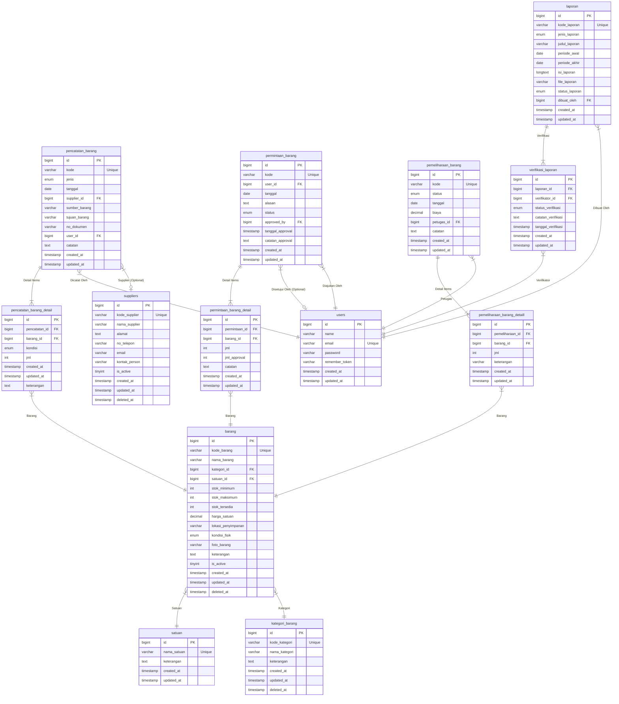

# Skema Relasi Database Logistik

Berikut adalah skema relasi database `db_logistik` dalam format Mermaid diagram.

```mermaid
erDiagram
    users {
        bigint id PK
        varchar name
        varchar email "Unique"
        varchar password
        varchar remember_token
        timestamp created_at
        timestamp updated_at
    }

    suppliers {
        bigint id PK
        varchar kode_supplier "Unique"
        varchar nama_supplier
        text alamat
        varchar no_telepon
        varchar email
        varchar kontak_person
        tinyint is_active
        timestamp created_at
        timestamp updated_at
        timestamp deleted_at
    }

    kategori_barang {
        bigint id PK
        varchar kode_kategori "Unique"
        varchar nama_kategori
        text keterangan
        timestamp created_at
        timestamp updated_at
        timestamp deleted_at
    }

    satuan {
        bigint id PK
        varchar nama_satuan "Unique"
        text keterangan
        timestamp created_at
        timestamp updated_at
    }

    barang {
        bigint id PK
        varchar kode_barang "Unique"
        varchar nama_barang
        bigint kategori_id FK
        bigint satuan_id FK
        int stok_minimum
        int stok_maksimum
        int stok_tersedia
        decimal harga_satuan
        varchar lokasi_penyimpanan
        enum kondisi_fisik
        varchar foto_barang
        text keterangan
        tinyint is_active
        timestamp created_at
        timestamp updated_at
        timestamp deleted_at
    }

    pencatatan_barang {
        bigint id PK
        varchar kode "Unique"
        enum jenis
        date tanggal
        bigint supplier_id FK
        varchar sumber_barang
        varchar tujuan_barang
        varchar no_dokumen
        bigint user_id FK
        text catatan
        timestamp created_at
        timestamp updated_at
    }

    pencatatan_barang_detail {
        bigint id PK
        bigint pencatatan_id FK
        bigint barang_id FK
        enum kondisi
        int jml
        timestamp created_at
        timestamp updated_at
        text keterangan
    }

    permintaan_barang {
        bigint id PK
        varchar kode "Unique"
        bigint user_id FK
        date tanggal
        text alasan
        enum status
        bigint approved_by FK
        timestamp tanggal_approval
        text catatan_approval
        timestamp created_at
        timestamp updated_at
    }

    permintaan_barang_detail {
        bigint id PK
        bigint permintaan_id FK
        bigint barang_id FK
        int jml
        int jml_approval
        text catatan
        timestamp created_at
        timestamp updated_at
    }

    pemeliharaan_barang {
        bigint id PK
        varchar kode "Unique"
        enum status
        date tanggal
        decimal biaya
        bigint petugas_id FK
        text catatan
        timestamp created_at
        timestamp updated_at
    }

    pemeliharaan_barang_detaill {
        bigint id PK
        bigint pemeliharaan_id FK
        bigint barang_id FK
        int jml
        varchar keterangan
        timestamp created_at
        timestamp updated_at
    }

    laporan {
        bigint id PK
        varchar kode_laporan "Unique"
        enum jenis_laporan
        varchar judul_laporan
        date periode_awal
        date periode_akhir
        longtext isi_laporan
        varchar file_laporan
        enum status_laporan
        bigint dibuat_oleh FK
        timestamp created_at
        timestamp updated_at
    }

    verifikasi_laporan {
        bigint id PK
        bigint laporan_id FK
        bigint verifikator_id FK
        enum status_verifikasi
        text catatan_verifikasi
        timestamp tanggal_verifikasi
        timestamp created_at
        timestamp updated_at
    }

    %% Relasi antar tabel
    barang }|--|| kategori_barang : "Kategori"
    barang }|--|| satuan : "Satuan"

    pencatatan_barang }|--o| suppliers : "Supplier (Optional)"
    pencatatan_barang }|--|| users : "Dicatat Oleh"
    pencatatan_barang ||--|{ pencatatan_barang_detail : "Detail Items"

    pencatatan_barang_detail }|--|| barang : "Barang"

    permintaan_barang }|--|| users : "Diajukan Oleh"
    permintaan_barang }|--o| users : "Disetujui Oleh (Optional)"
    permintaan_barang ||--|{ permintaan_barang_detail : "Detail Items"

    permintaan_barang_detail }|--|| barang : "Barang"

    pemeliharaan_barang }|--|| users : "Petugas"
    pemeliharaan_barang ||--|{ pemeliharaan_barang_detaill : "Detail Items"

    pemeliharaan_barang_detaill }|--|| barang : "Barang"

    laporan }|--|| users : "Dibuat Oleh"
    laporan ||--|{ verifikasi_laporan : "Verifikasi"

    verifikasi_laporan }|--|| users : "Verifikator"
```
