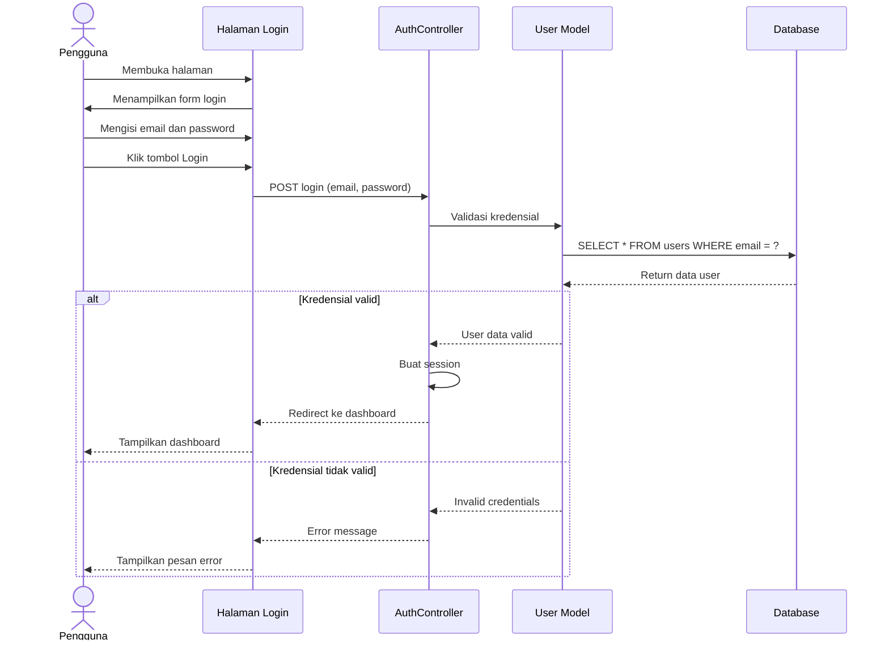
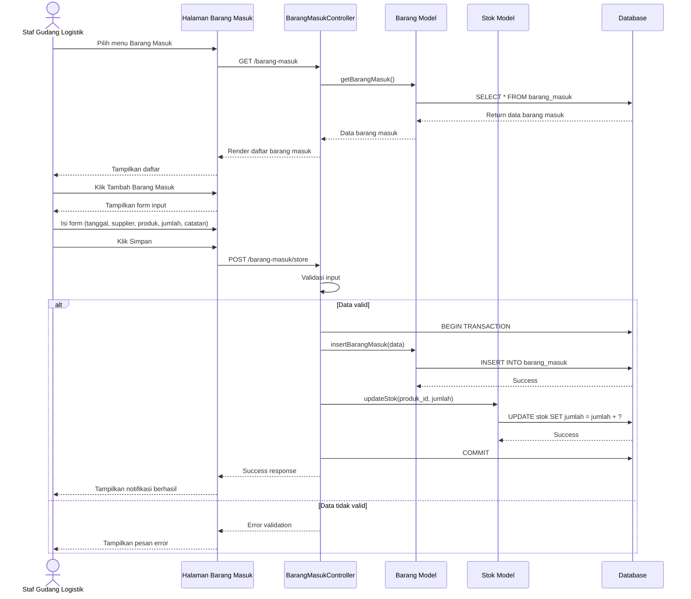
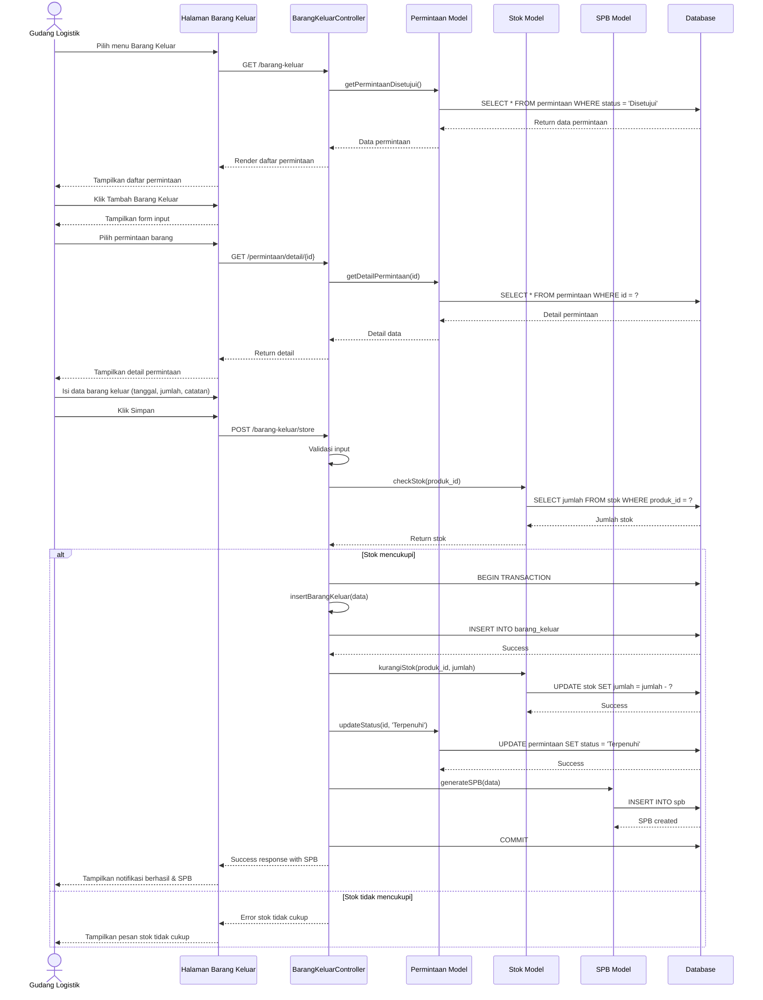
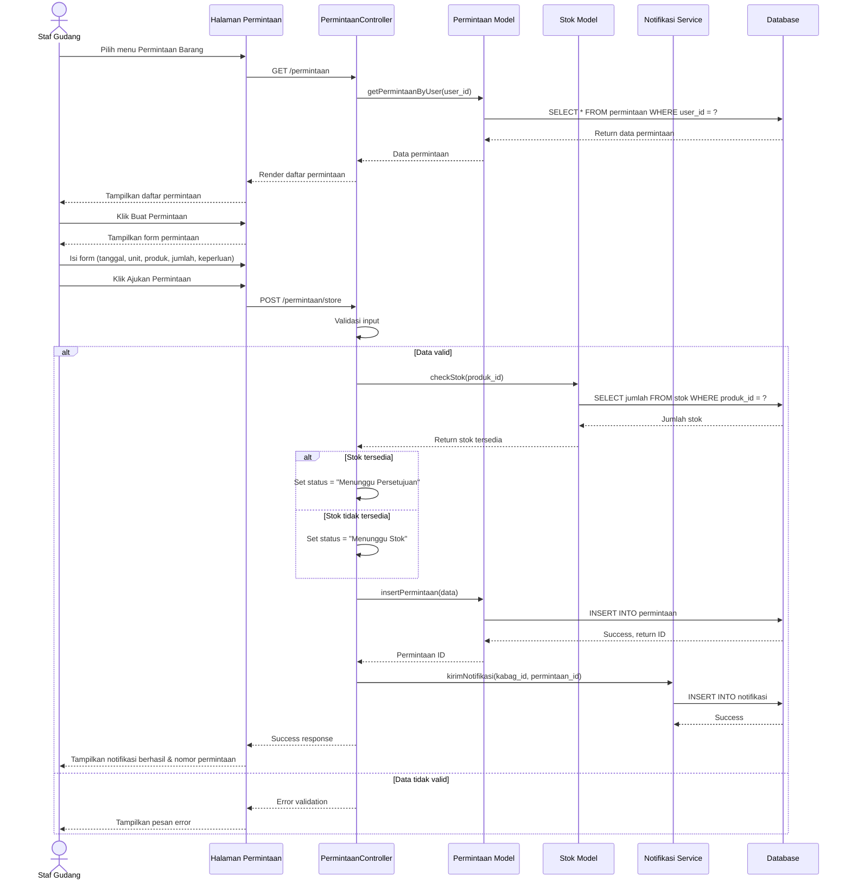
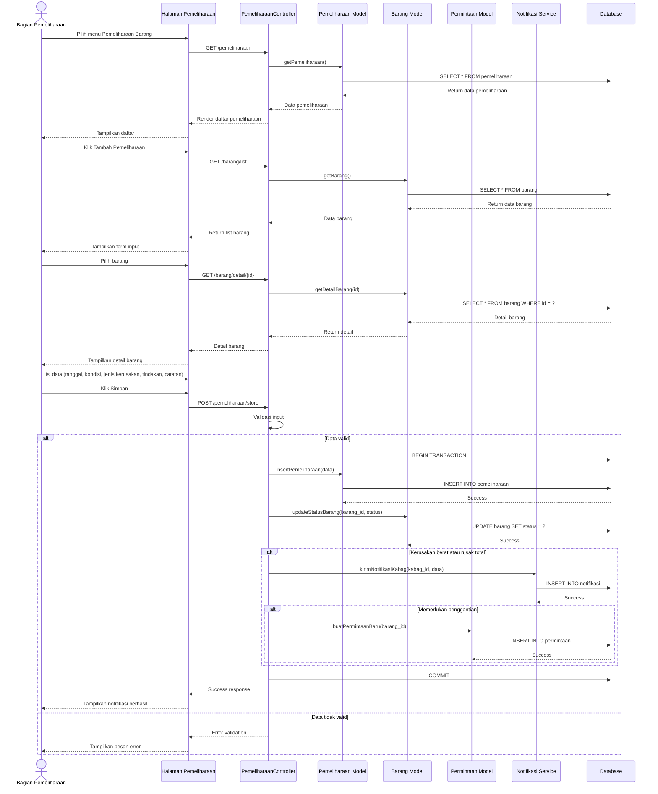
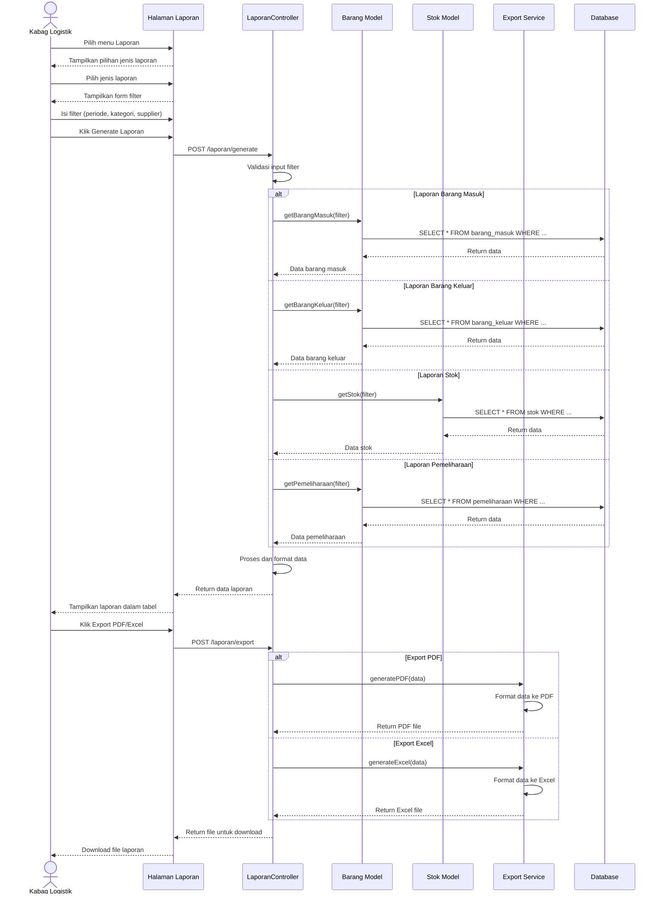

# KODE MERMAID SEQUENCE DIAGRAM
## Sistem Informasi Monitoring Logistik dan Alat Produksi PT Timah Tbk

---

## 1. Sequence Diagram - Login

### Prolog

**Gambar 4.7 Sequence Diagram Login**

Gambar 4.7 menunjukkan sequence diagram untuk proses login pada Sistem Informasi Monitoring Logistik dan Alat Produksi di PT Timah Tbk. Diagram ini menggambarkan interaksi antara pengguna dengan komponen sistem mulai dari membuka halaman login, memasukkan kredensial (email dan password), proses validasi oleh AuthController, pengecekan data pengguna di database, hingga pembuatan session dan pengalihan ke halaman dashboard sesuai dengan role pengguna. Diagram ini juga menampilkan skenario alternatif ketika kredensial yang dimasukkan tidak valid, sistem akan menampilkan pesan error dan mengarahkan pengguna kembali ke form login. Proses ini melibatkan empat komponen utama yaitu Pengguna sebagai aktor, Halaman Login sebagai interface, AuthController sebagai pengendali proses autentikasi, User Model sebagai pengelola logika pengguna, dan Database sebagai penyimpan data.

---

## 2. Sequence Diagram - Kelola Barang Masuk

### Prolog

**Gambar 4.8 Sequence Diagram Kelola Barang Masuk**

Gambar 4.8 menampilkan sequence diagram untuk proses pengelolaan barang masuk pada sistem. Diagram ini mengilustrasikan alur kerja lengkap mulai dari Staf Gudang Logistik membuka menu barang masuk, sistem menampilkan daftar barang masuk yang telah tercatat, penambahan data barang masuk baru melalui form input yang mencakup informasi tanggal, supplier, produk, jumlah, dan catatan, hingga penyimpanan data ke database. Proses penting yang digambarkan adalah transaksi database yang melibatkan penyimpanan data barang masuk dan pembaruan stok secara otomatis dalam satu transaksi (BEGIN TRANSACTION dan COMMIT) untuk menjaga konsistensi data. Diagram ini juga menunjukkan validasi input data dan penanganan error jika data yang dimasukkan tidak valid. Komponen yang terlibat meliputi Staf Gudang Logistik sebagai aktor, Halaman Barang Masuk, BarangMasukController, Barang Model, Stok Model, dan Database.

---

## 3. Sequence Diagram - Kelola Barang Keluar

### Prolog

**Gambar 4.9 Sequence Diagram Kelola Barang Keluar**

Gambar 4.9 memperlihatkan sequence diagram untuk proses pengeluaran barang dari gudang logistik. Diagram ini menggambarkan alur proses yang dimulai dari Gudang Logistik membuka menu barang keluar dan melihat daftar permintaan yang telah disetujui, memilih permintaan barang yang akan dipenuhi, sistem menampilkan detail permintaan tersebut, pengisian data pengeluaran barang, hingga proses penyimpanan transaksi. Aspek penting yang ditampilkan adalah pengecekan ketersediaan stok barang sebelum proses pengeluaran dilakukan. Jika stok mencukupi, sistem akan melakukan serangkaian proses dalam satu transaksi database meliputi pencatatan barang keluar, pengurangan stok secara otomatis, pembaruan status permintaan menjadi "Terpenuhi", dan pembuatan Surat Pengeluaran Barang (SPB) sebagai bukti formal. Diagram juga menunjukkan skenario alternatif ketika stok tidak mencukupi, sistem akan menampilkan pesan error. Komponen yang terlibat adalah Gudang Logistik, Halaman Barang Keluar, BarangKeluarController, Permintaan Model, Stok Model, SPB Model, dan Database.

---

## 4. Sequence Diagram - Permintaan Barang

### Prolog

**Gambar 4.10 Sequence Diagram Permintaan Barang**

Gambar 4.10 menampilkan sequence diagram untuk proses pengajuan permintaan barang oleh unit kerja. Diagram ini menjelaskan alur lengkap dimulai dari Staf Gudang membuka menu permintaan barang dan melihat riwayat permintaan yang pernah diajukan, membuat permintaan baru melalui form yang berisi informasi tanggal, unit pemohon, produk yang diminta, jumlah, dan keperluan penggunaan barang. Setelah validasi input, sistem melakukan pengecekan ketersediaan stok di gudang. Berdasarkan hasil pengecekan, sistem akan menentukan status permintaan: jika stok tersedia maka status diset "Menunggu Persetujuan", namun jika stok tidak tersedia maka status diset "Menunggu Stok". Proses selanjutnya adalah penyimpanan data permintaan ke database dan pengiriman notifikasi otomatis kepada Kabag Logistik untuk proses persetujuan. Diagram ini juga menangani validasi data dan menampilkan nomor permintaan kepada pemohon sebagai bukti pengajuan. Komponen yang terlibat meliputi Staf Gudang, Halaman Permintaan, PermintaanController, Permintaan Model, Stok Model, Notifikasi Service, dan Database.

---

## 5. Sequence Diagram - Pemeliharaan Barang

### Prolog

**Gambar 4.11 Sequence Diagram Pemeliharaan Barang**

Gambar 4.11 mengilustrasikan sequence diagram untuk proses pemeliharaan dan perawatan barang atau alat produksi. Diagram ini menggambarkan alur kerja yang dimulai dari Bagian Pemeliharaan membuka menu pemeliharaan dan melihat riwayat pemeliharaan yang telah dilakukan, menambah catatan pemeliharaan baru dengan terlebih dahulu memilih barang dari daftar yang tersedia, sistem menampilkan detail barang yang dipilih, kemudian pengisian form pemeliharaan yang mencakup tanggal pemeriksaan, kondisi barang, jenis kerusakan, tindakan yang dilakukan, dan catatan tambahan. Setelah validasi, sistem melakukan transaksi database yang mencakup penyimpanan data pemeliharaan dan pembaruan status barang sesuai kondisinya. Diagram ini juga menampilkan logika kondisional dimana jika terjadi kerusakan berat atau rusak total, sistem akan secara otomatis mengirimkan notifikasi kepada Kabag Logistik dan dapat membuat permintaan barang pengganti secara otomatis jika diperlukan. Proses ini melibatkan komponen Bagian Pemeliharaan, Halaman Pemeliharaan, PemeliharaanController, Pemeliharaan Model, Barang Model, Permintaan Model, Notifikasi Service, dan Database.

---

## 6. Sequence Diagram - Laporan Logistik

### Prolog

**Gambar 4.12 Sequence Diagram Laporan Logistik**

Gambar 4.12 menunjukkan sequence diagram untuk proses pembuatan dan ekspor laporan logistik. Diagram ini menggambarkan alur proses yang dimulai dari Kabag Logistik membuka menu laporan dan memilih jenis laporan yang diinginkan (barang masuk, barang keluar, stok, atau pemeliharaan), mengisi kriteria filter seperti periode tanggal, kategori barang, dan supplier, kemudian sistem melakukan validasi filter dan mengambil data dari database sesuai jenis laporan yang dipilih. Diagram menampilkan empat percabangan alternatif untuk masing-masing jenis laporan yang memiliki query database berbeda. Setelah data diambil, sistem memproses dan memformat data kemudian menampilkannya dalam bentuk tabel di halaman laporan. Fitur penting yang digambarkan adalah kemampuan ekspor laporan ke dalam format PDF atau Excel melalui Export Service yang akan memformat data sesuai format file yang dipilih, kemudian file hasil ekspor dapat diunduh oleh pengguna. Proses ini melibatkan komponen Kabag Logistik, Halaman Laporan, LaporanController, Barang Model, Stok Model, Export Service, dan Database.

---